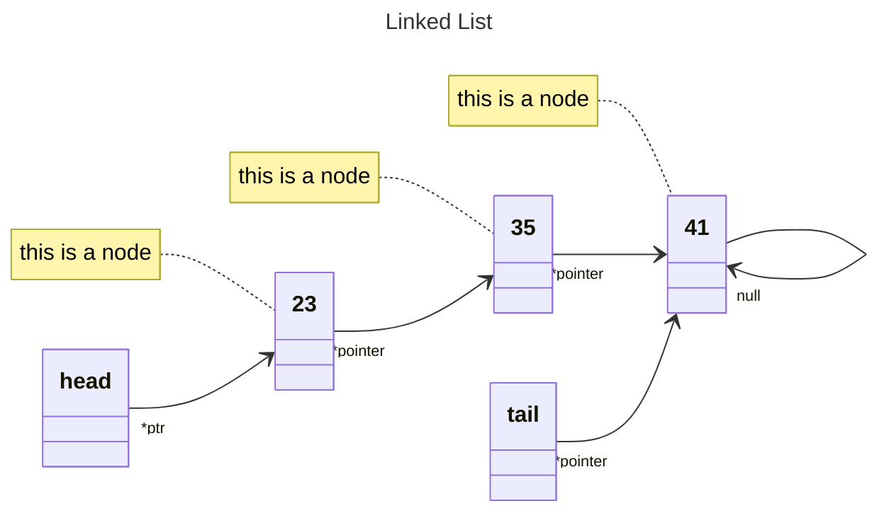
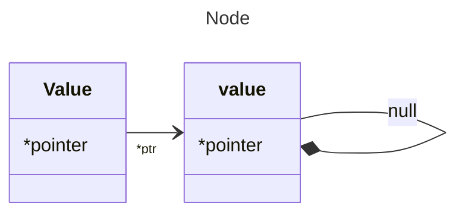
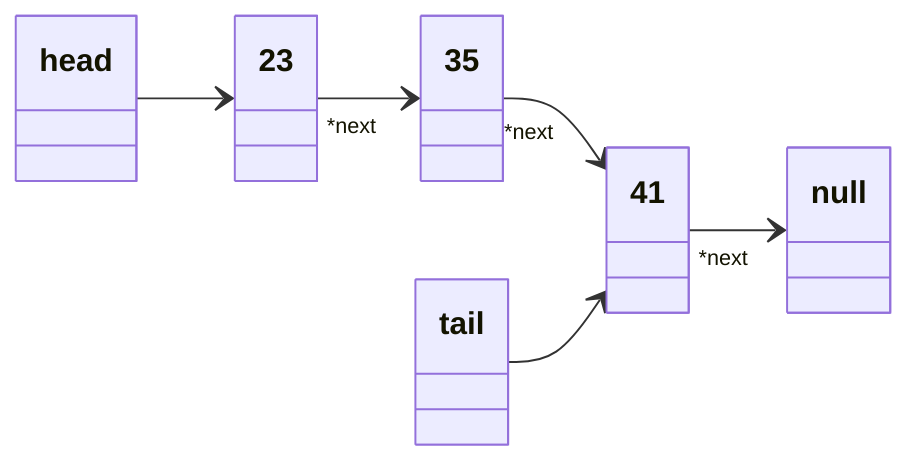

# Linked List

### Linked List vs Arrays.
Let's compare linked lists with arrays. 
>It just depends what you're going to be using your data structure for...


| Operation           | Linked Lists | Arrays   |
|---------------------|--------------|----------|
| Push                | O(1)         | O(1)     |
| Pop                 | <span style="background-color:red">O(n)</span> | <span style="background-color:green">O(1)</span>  |
| Shift               | <span style="background-color:green">O(1)</span> | <span style="background-color:red">O(n)</span>  |
| Unshift             | <span style="background-color:green">O(1)</span> | <span style="background-color:red">O(n)</span>  |
| Insert              | O(n)         | O(n)     |
| Delete              | O(n)         | O(n)     |
| Lookup by Index     | <span style="background-color:red">O(n)</span> | <span style="background-color:green">O(1)</span>  |
| Lookup by Value     | O(n)         | O(n)     |

## Linked List are made of **_Nodes_**...


## ...nodes are mades up of **_value_** and **_*pointer_**.



    So this node can be an object,
    will looks something like this.

```js
    Node {
        value: int
        *next: null
    }
```


Linked list looks something like this...



```js
LinkedList {
        head: Node {
                value: 23
                next: Node {
                        value: 35
                        next: Node {
                                value: 41
                                next: null
                                }
                        }
                }
        length: 3
        tail: Node {
                value:10,
                next: null
                }
        }
```