# Linked List

### Linked List vs Arrays.
Let's compare linked lists with arrays. 
>It just depends what you're going to be using your data structure for...


| Operation           | Linked Lists | Arrays   |
|---------------------|--------------|----------|
| Push                | O(1)         | O(1)     |
| Pop                 | <span style="background-color:red">O(n)</span> | <span style="background-color:green">O(1)</span>  |
| Shift               | <span style="background-color:green">O(1)</span> | <span style="background-color:red">O(n)</span>  |
| Unshift             | <span style="background-color:green">O(1)</span> | <span style="background-color:red">O(n)</span>  |
| Insert              | O(n)         | O(n)     |
| Delete              | O(n)         | O(n)     |
| Lookup by Index     | <span style="background-color:red">O(n)</span> | <span style="background-color:green">O(1)</span>  |
| Lookup by Value     | O(n)         | O(n)     |


## Linked List are made of **_Nodes_**...
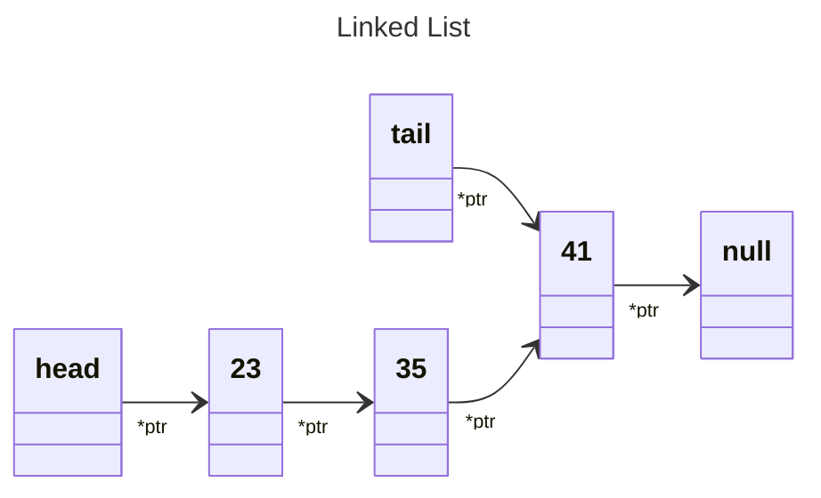

### ...nodes are mades up of **_value_** and **_*pointer_**.

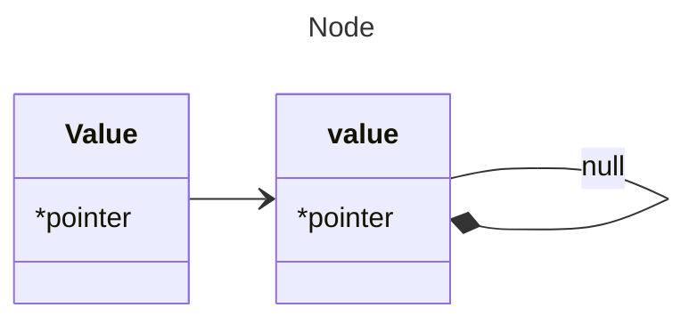

    So this node is actually an object.
    That looks something like this

```js
    {
        value: int
        *next: null
    }

```


Linked list looks something like this...

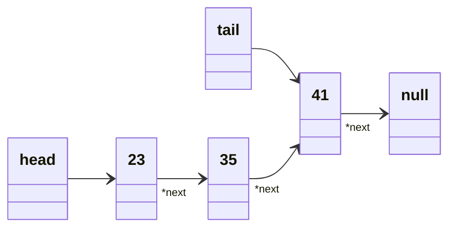

```js
    {
        head: {
                value: 23
                *next: {
                        value: 35
                        *next: {
        tail: ----------------> value: 41
                                *next: null
                            }
                    }
            }
    }
```

## Class LinkedList and Class Node
Create a LinkedList class and Node class (to rewrite code).

### constructor(value) {...}
The constructor has a couple of things in common with the other methods of that linked list.

```js
class LinkedList {
    constructor(value) {
        // create new Node
    }
    push(value) {
        // create new Node
        // add Node to end
    }
    unshift(value) {
        // create new Node
        // add Node to beginning
    }
    insert(index, value) {
        // create new Node
        // insert Node
    }
}
```
constructor and the other methods each get passed a argument "value" and create a new Node.

    we don't want to rewrite this code for different times in each one of these methods.

    So we're going to create a separate class for creating nodes.

```js
class Node {
    constructor(value) {
        this.value = value
        this.next = null
    }
}

// to create a node
const newNode = new Node(0)

class LinkedList {
    constructor(value) {
        const newNode = new Node(value)
        this.head = newNode
        this.tail = this.head
        this.length = 1
    }
}

let myLinkedList = new LinkedList(5)
```
---

### method - push(value) {...}
 
push(value): Places an element on top of the stack

    Start out with our edge case first... when we try to add(push) a node on the list

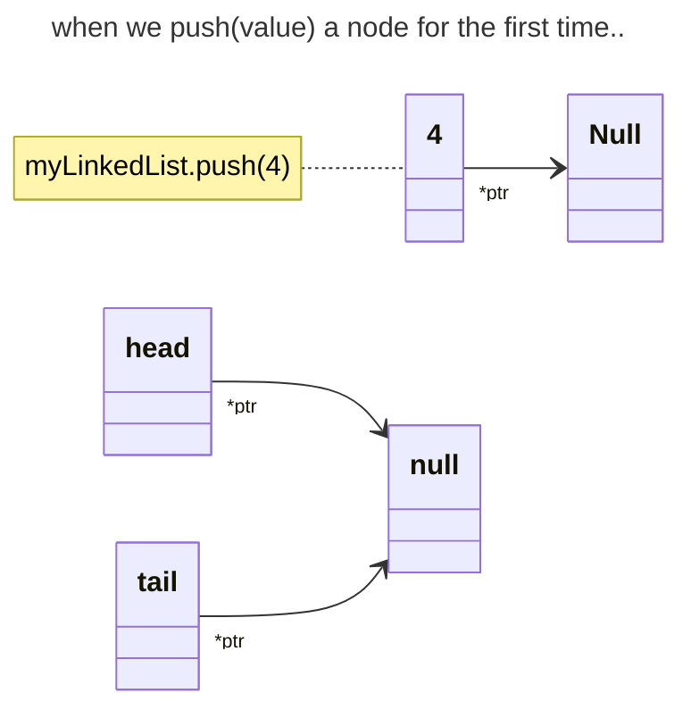
    but head and tail pointing to null...

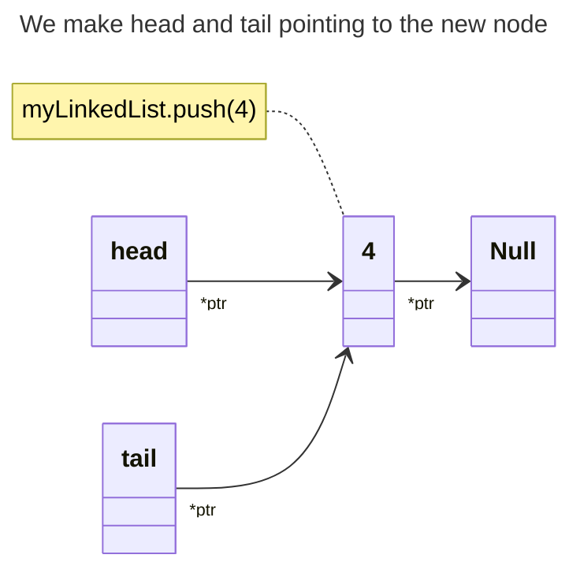
```js
    if (!this.head){
            this.head = newNode
            this.tail = newNode
            } 
```

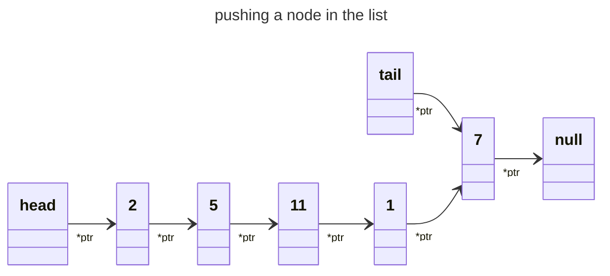


```js
 push(value){ // Places an element on the linked list the tail
    const newNode = new Node(value)
    if (!this.head){
        this.head = newNode
        this.tail = newNode
    } else {
        this.tail.next = newNode
        this.tail = newNode
    }
    this.length++
    return this
 }
```

## method - pop() {...} 
 
We're just going to:
1. remove the item from the end.
2. move tail over to the previous item
3. return the item that we removed.

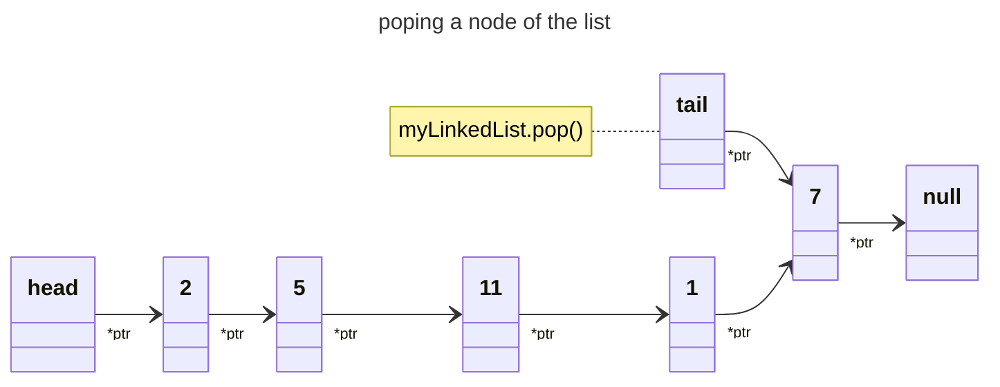
---
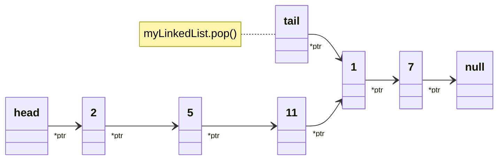
---
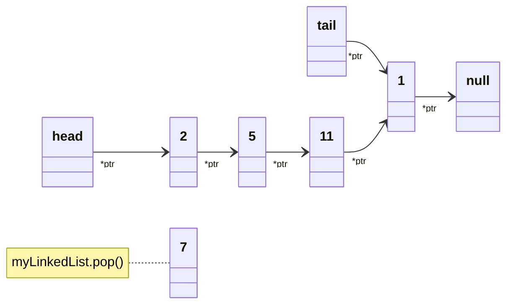
### So we do have a couple of edge cases...
    
    Edge case #1: a linked list that don't have any items in it.
    (we can't pop something from this linked list).

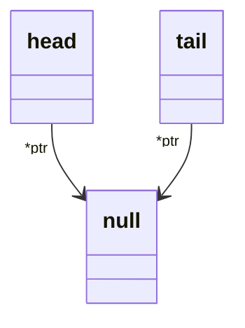

    Edge case #2: if we have a list with one item.
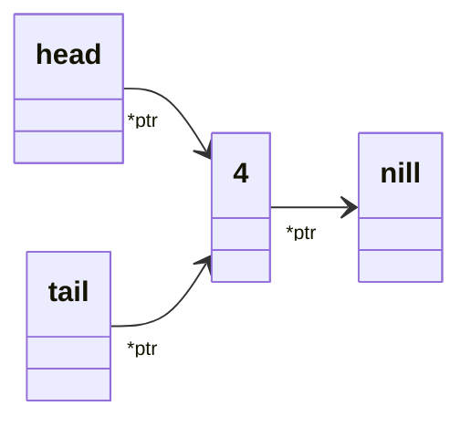
    Edge case #3: if we have a list with some items in it
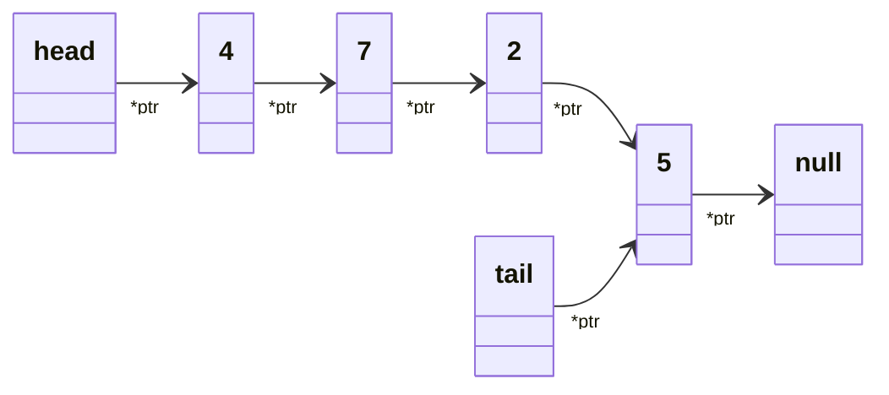

### How we do track the node before the end??!!
    we going to do this is with two variables, temp and pre.
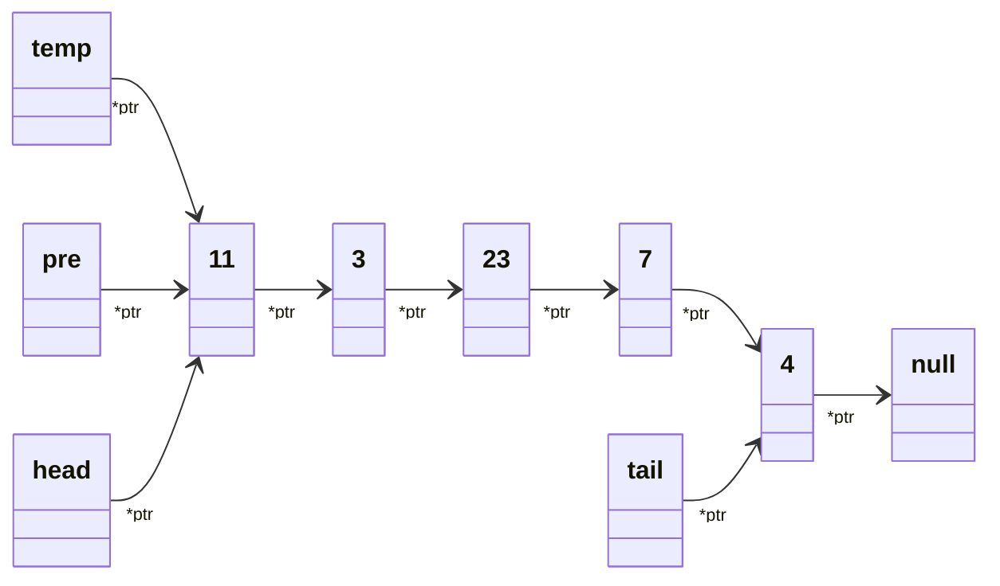
    Temp is going to be the variable that once we iterate through this list is going to be pointing to that last item, that we return.
    
    Pre is going to point to the item that is next to last.

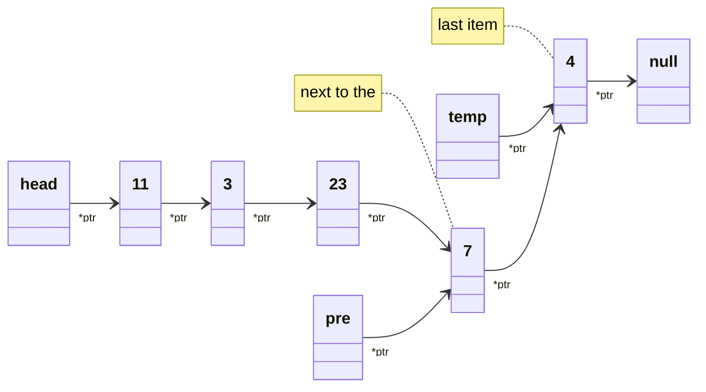
    We're going to say that tail is equal to pre.
    (pre is used only to set tail.)
---
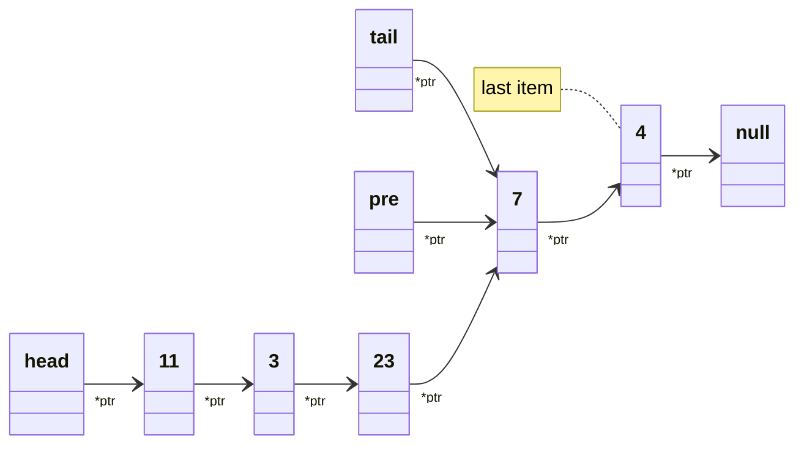
---
    Then we say tail.next = null, which removes that last item.

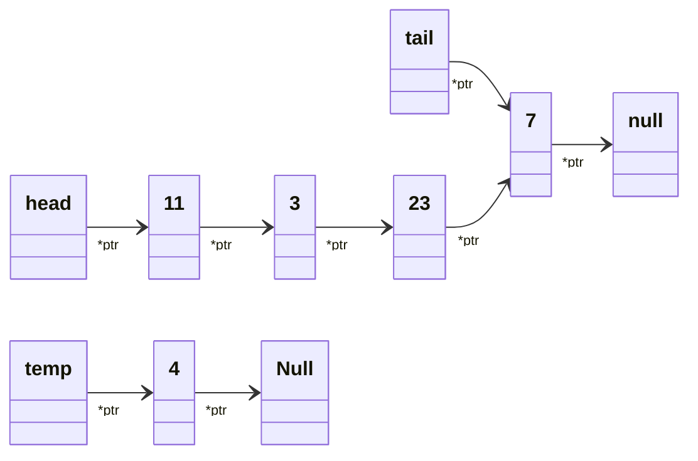
---
    And bring the temp variable back to finish the pop method
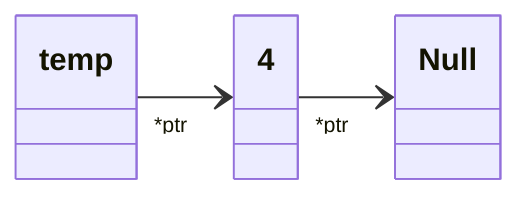


```js
 pop() {
    if (!this.head) return undefined // Edge case #1
    // Edge case #2
    let temp = this.head
    let pre = this.head
    // Edge case #3
    while (temp.next) {
        pre = temp
        temp = temp.next
        }
    this.tail = pre
    this.tail.next = null
    this.length--
    if (this.length === 0){
        this.head = null
        this.tail = null
        }
    return temp
}
```

## method - unshift(){...}


## method - shift(){...}

## method - get(){...}

## method - set(){...}

## method - insert(){...}

## method - remove(){...}

## method - reverse(){...}


```js

class Node {
    constructor(value) {
        this.value = value
        this.next = null
    }
}

class LinkedList {
    constructor(value) {
        const newNode = new Node(value)
        this.head = newNode
        this.tail = this.head
        this.length = 1
    } 
    push(value){
        const newNode = new Node(value)
        if (!this.head){
            this.head = newNode
            this.tail = newNode
            } else {
            this.tail.next = newNode
        this.tail = newNode
            }
        this.length++
        return this
    }
    pop() {
        if (!this.head) return undefined
        let temp = this.head
        let pre = this.head
        while (temp.next) {
            pre = temp
            temp = temp.next
            }
        this.tail = pre
        this.tail.next = null
        this.length--
        if (this.length === 0){
            this.head = null
            this.tail = null
            }
        return temp
    }
    
}

let myLinkedList = new LinkedList(5)
```