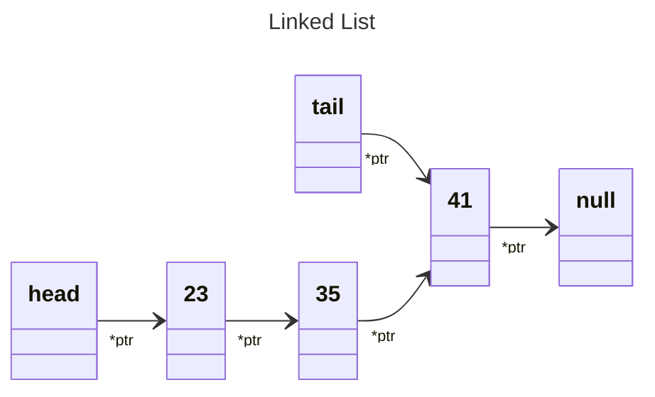
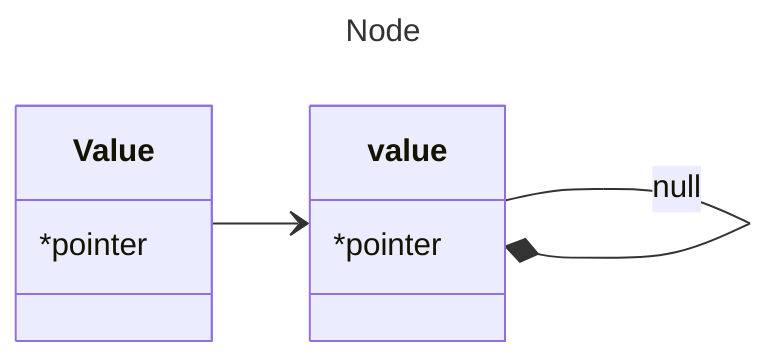
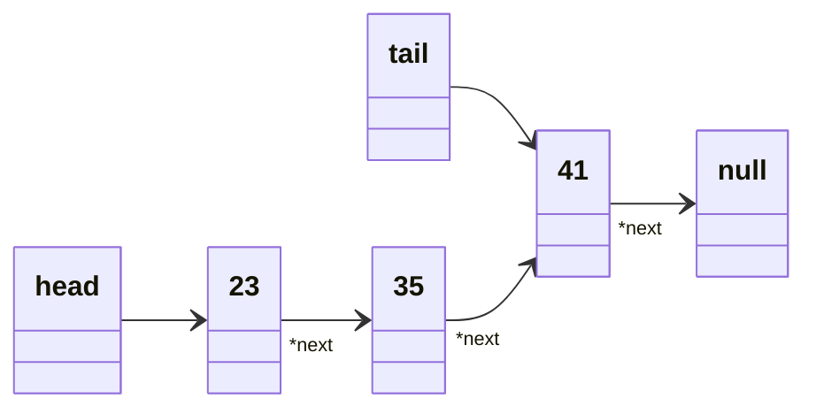

# Linked List

our first data structure that we build.

## to introduce linked lists, 

### Linked List vs Arrays.
    It just depends what you're going to be using your data structure for.


| Operation           | Linked Lists | Arrays   |
|---------------------|--------------|----------|
| Push                | O(1)         | O(1)     |
| Pop                 | <span style="background-color:red">O(n)</span> | <span style="background-color:green">O(1)</span>  |
| Shift               | <span style="background-color:green">O(1)</span> | <span style="background-color:red">O(n)</span>  |
| Unshift             | <span style="background-color:green">O(1)</span> | <span style="background-color:red">O(n)</span>  |
| Insert              | O(n)         | O(n)     |
| Delete              | O(n)         | O(n)     |
| Lookup by Index     | <span style="background-color:red">O(n)</span> | <span style="background-color:green">O(1)</span>  |
| Lookup by Value     | O(n)         | O(n)     |


## Linked List are made of **_Nodes_**




### Nodes are mades up of **_value_** and **_*pointer_**.



    So this node is actually an object.
    That looks something like this

```js
    {
        value: int
        *next: null
    }

```


Linked list looks something like this...



```js
    {
        head: {
                value: 23
                *next: {
                        value: 35
                        *next: {
        tail: ----------------> value: 41
                                *next: null
                            }
                    }
            }
    }
```
